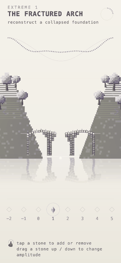
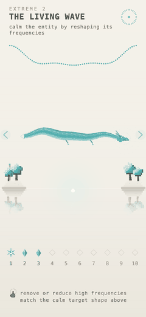
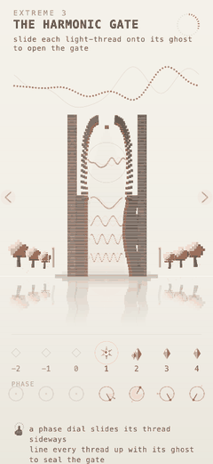
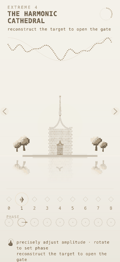

# A Line Remembered

A minimalist procedural puzzle game built around Fourier decomposition. The
player discovers and manipulates the hidden harmonic structure of the world —
every mountain bridge, living dragon, sealed gate and gothic cathedral is
generated from the same Fourier representation and physically transforms as the
harmonics change.

> The world is the UI. A Fourier coefficient feels like architecture, not data.

**Play:** https://codyhsieh.com/fourier/

<p align="center">
  
  
  
  
</p>
<p align="center"><sub>
  Each scene is generated from the same harmonics and morphs as you change them —
  amplitude rebuilds the arch, frequency-energy calms the dragon, phase slides the
  gate's light-threads into alignment, and the cathedral responds to every knob.
</sub></p>

## Stack

- **PixiJS 8** — WebGL renderer; every shape is procedural pixel-art (no image assets)
- **Web Audio API** — one sine oscillator per harmonic + a resonance pad (no audio assets)
- **TypeScript + Vite**, deployed to GitHub Pages

## Run

```bash
nvm use 22          # needs Node 18+ (developed on 22)
npm install
npm run dev         # http://localhost:5173  (also on your LAN for phone testing)
npm run build       # tsc --noEmit + production bundle
npm run preview     # serve the built bundle
```

## Architecture

A single source of truth; every system *reads* from it and none recompute
Fourier data independently.

```
FourierWorldState         active harmonics + derived ShapeData         (src/core)
  └─ ShapeData            256-sample reconstruction: energy, band       (src/core)
                          energies, dominant freq, phaseComplexity…
       ├─ Renderers       bridge / creature / gate / cathedral   (src/render/structures)
       ├─ AudioEngine     sine oscillators + resonance pad              (src/audio)
       ├─ Scoring         ShapeScore: waveform / phase / energy / coverage (src/core)
       └─ Controls        stone palette + phase dials              (src/render/ui)
```

Every renderer consumes the *same* `ShapeData` (and the harmonic list) and only
ever **interprets** it — drawing physical architecture, never a chart. A shared
`Painter` draws each structure plus its rippled water reflection.

## Levels

Ten levels in all: each concept is introduced, practiced, and given a boss,
with the cathedral as the finale.

| # | Level | Teaches | Biome |
|---|-------|---------|-------|
| 1 | The Fractured Arch | **amplitude** — reconstruct the span | bridge (lavender) |
| 2 | The Living Wave | **frequency energy** — calm the high frequencies | dragon (cyan) |
| 3 | The Harmonic Gate | **phase** — align the light-threads | gate (coral) |
| 4 | The Twin Span | amplitude — raise two arches | bridge |
| 5 | The Restless Deep | energy — still a denser agitation | dragon |
| 6 | The Sealed Vault | phase — align five threads | gate |
| 7 | The Long Viaduct | amplitude — strip an over-built span | bridge |
| 8 | The Tideturner | energy — break the storm (boss) | dragon |
| 9 | The Last Seal | phase — align six threads (boss) | gate |
| 10 | The Harmonic Cathedral | **combined mastery** — amplitude + phase | cathedral (gold) |

- **L1 — Fractured Arch.** Two mountains joined by a stone arch bridge (2D side
  view). The deck top follows the waveform and meets each mountain ledge; pixel
  travellers walk across the top and tip off the edge into the water wherever the
  span is broken. Rebuilding the wave heals the gaps so they cross safely.
- **L2 — Living Wave.** A serpentine dragon whose body *is* the waveform. High
  frequencies raise its crest and open its jaw (aggression); removing them calms
  it into a smooth form. `aggression = highFrequencyEnergy / totalEnergy`.
- **L3 — Harmonic Gate.** A sealed gothic doorway with a rose-window rune-lock.
  Each harmonic drives one concentric ring rotated by its **phase**; wrong phases
  shear the doorway apart, aligned phases seal the arch and open it with light.
- **L4 — Harmonic Cathedral.** Every palette knob (indices 0–8, **amplitude and
  phase**) drives a distinct element: foundation, nave + spire-sway, flanking
  arches, a rotating rose window, colonnade, pinnacles, tracery, flying
  buttresses, finials. Disable a harmonic and its architecture disappears.

## Interaction

- **Stones** (all levels) — tap a stone to add/remove that harmonic; drag a stone
  up/down to set its **amplitude**. The glyph grows from an inert cube to a
  blossoming crystal as amplitude rises.
- **Phase dials** (L3, L4) — a row of circular dials; drag around to rotate a
  harmonic's **phase**.
- **Navigate levels** — on-screen ‹ › chevrons, or the keyboard arrow keys.
- Solving a level fades in a banner; tap to continue to the next.

The whole scene is **responsive**: a fixed design width with a height that tracks
the device aspect, so it fills the screen edge-to-edge with no letterbox. Audio
unlocks on first tap and uses the iOS `playback` audio session so it isn't
silenced by the mute switch (Safari 16.4+).

## Dev query params

- `?level=N` — jump straight to level N (1–4)
- `?solve=1` — snap the world onto its target solution (to inspect the solved state)

## Deploy

Pushing to `main` triggers `.github/workflows/deploy.yml`, which builds and
publishes `dist/` to GitHub Pages (served at the custom domain above).
